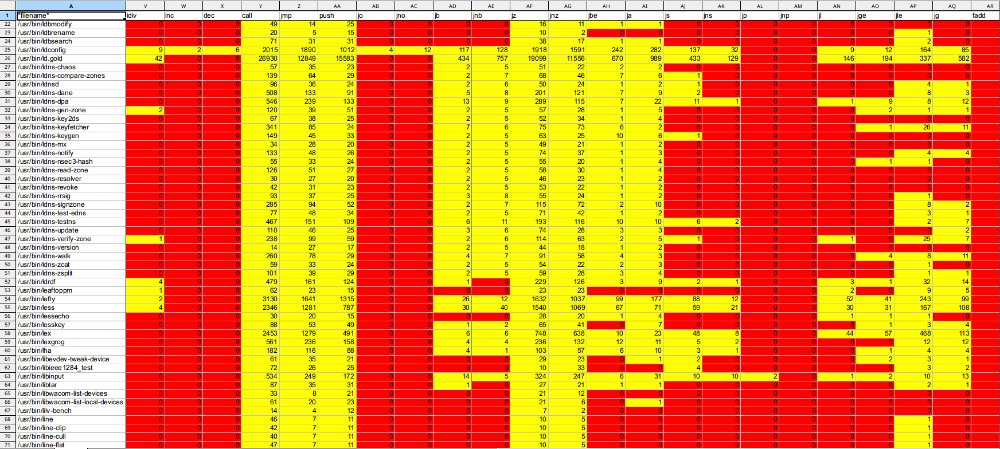

# What is the most popular instruction?

That is the question that I wanted to answer.

You can run it on an x64 ELF files and it will read out the `.text` 
section and count the instructions, writing the results to stdout in 
comma-separated format.

```txt
[popularity-contest]$ ./main /usr/bin/ls /usr/bin/bash 2>/dev/null 
*filename*,setnz,addt,test,test,sbbt,andt,subt,xort,cmpt,rol,ror,shl,shr,sar,test,not,neg,mul,imul,div,idiv,call,jmp,push,jo,jno,jb,jnb,jz,jnz,jbe,ja,js,jns,jp,jl,jge,jle,jg,fadd,fmul,fsubr,fld,fstp,fldcw,fnstcw,ret,fldz,fild,fistp,fucomi,fcomi,fmulp,fdivpp,hlt,ud2,cmovb,cmovnb,cmovz,cmovnz,cmovbe,cmova,cmovs,cmovns,cmovl,cmovge,cmovle,cmovg,bt,btc,bt,cqo,pxor,bswap,addss,mulss,subss,divss,addsd,mulsd,fcomip,divsd,cdq,cdqe,cvtsi2sd,cvtsi2ss,cvttss2si,movaps,comiss,lea,mov,movdqa,movdqu,rep,rep,movsx,movsxd,movzx,nop,pop,rep,fxch,fucomip,movss,movups,endbr64
/usr/bin/ls,295,798,110,22,31,247,544,825,1475,1,4,39,60,49,729,9,10,17,38,25,2,1170,1002,573,15,3,41,84,1062,721,133,101,53,21,3,1,3,37,49,9,4,3,18,25,12,6,350,0,11,6,2,4,2,4,1,0,5,12,38,30,1,4,6,5,1,0,3,0,1,6,5,1,14,0,6,8,3,1,2,2,3,1,1,11,4,10,6,29,16,898,6141,36,4,0,0,19,87,409,1083,753,1,17,1,12,13,6
/usr/bin/bash,706,3779,1110,127,141,1398,2210,5364,7602,1,0,240,316,99,9272,23,31,7,68,3,12,12679,6805,3774,0,1,52,86,9428,5864,321,326,300,120,0,85,130,590,336,0,0,0,0,3,0,0,1921,1,1,0,0,0,0,0,1,14,2,8,170,161,4,3,10,13,6,11,13,10,0,0,44,5,6,1,0,0,0,0,0,0,0,0,9,137,0,0,0,214,0,6387,45623,103,31,1,4,237,1601,1557,7635,5332,20,0,0,0,44,5
```

Progress and errors are written to stderr. 
The CSV lines are written to stdout.


## Why?

There exist about 1500+ instructions in x86-64.
If one wanted to learn x86-64, maybe it is reasonable to look into 
which instructions are the most used.

Which lead me to the question, which instruction is the most popular?
How about the top 5? What if I could count them all?

Why does x86 have so many variations in jump instructions?



## Building

Download the source.

```
git clone https://github.com/sir-ragna/popularity-contest.git
```

This project depends on [nmd](https://github.com/Nomade040/nmd).
Update the git submodule to download it.

```
git submodule update --init --recursive
```

Then you can compile it with your compiler of choice.

```
gcc -Wall -O2 -o main main.c
```

There is also a Makefile. It has `make release`, `make debug` and 
`make perf`. Check [perf.md](perf.md) for that last one.


## Valgrind

I use valgrind to check for memory leaks.
Before you do this I suggest compiling with debug symbols, use `-g`.

```sh
gcc -g -o main main.c
valgrind --leak-check=full --show-leak-kinds=all --track-origins=yes --log-file=valgrind-out.txt ./main /bin/a* 2>/dev/null >/dev/null
```
